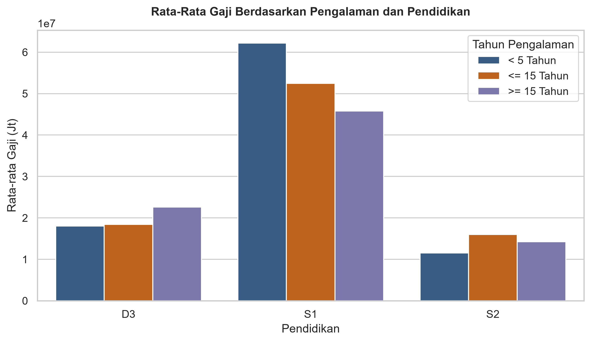
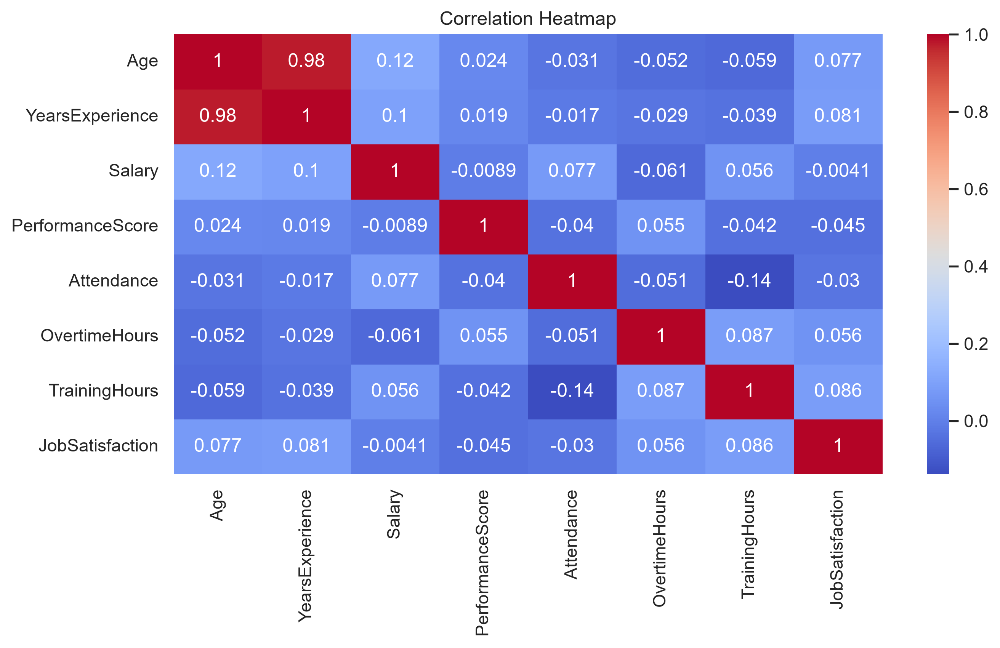

# 📊 Analisis Eksplorasi dan Visualisasi Data
File ini merupakan jawaban tugas pertemuan ke-3, This file contains the answers for the third session's assignment.
## 📝 Deskripsi Proyek 
### Proyek ini dirancang untuk mengetahui perbandingan dan hubungan antar variabel.
Disajikan sebuah data pegawai di sebuah perusahaan x dengan staff dari berbagai kalangan (Dataset_Pegawai.csv).
didalam dataset terdapat:
| Kolom |
| ----- |
| `nama`, `jenis kelamin`, `usia`, `department`, `posisi`, `tahun pengalaman`, `pendidikan`, `gaji`, `skor performa`, `kehadiran`, `jam lembur`, `jam latihan`, `kepuasan kerja`, `status pernikahan`, `kota`, `promosi`, `pengurangan jumlah anggota`|

---

## 📋 Hasil Analisis 

### 🖼️ Visual 1
---

#### Sebuah perusahaan 'x' menjadi bahan perbincangan yang hangat di kalangan gen z setelah tersebarnya kabar angin dari salah satu karyawan perusahaan 'x' menceritakan di perusahaan yang ia tempati didominasi oleh lulusan S1 dan mendapatkan gaji yang fantastis. Setelah di analisis ternyata kabar angin tersebut terbukti benar bahkan lulusan S1 dengan pengalaman kurang dari 5 tahun rata-rata mendapatkan gaji di atas 6 Juta, dengan tersebarnya kabar tersebut perusahaan ini menjadi top 1 perusahaan yang diimpikan oleh gen z untuk bekerja di perusahaan 'x', mengapa fenomena ini bisa terjadi?
---
### 🖼️ Visual 2
---

#### Setelah dibedah lebih dalam lagi tidak hanya pengalaman saja yang berhebungan dengan gaji, ternyata usia juga memili hubungan yang kuat dengan gaji di perusahaan 'x'
----
## 📝 Kesimpulan

### Dapat disimpulkan bahwa perusahaan 'x' telah menarik perhatian gen z terutama lulusan S1, namun apakah lulusan S1 dengan minimnya pengalaman menjadi indikator untuk diterima di perusahaan tersebut? ternyata ada faktor lain yang membuat diterima di perusahaan tersebut yaitu usia
